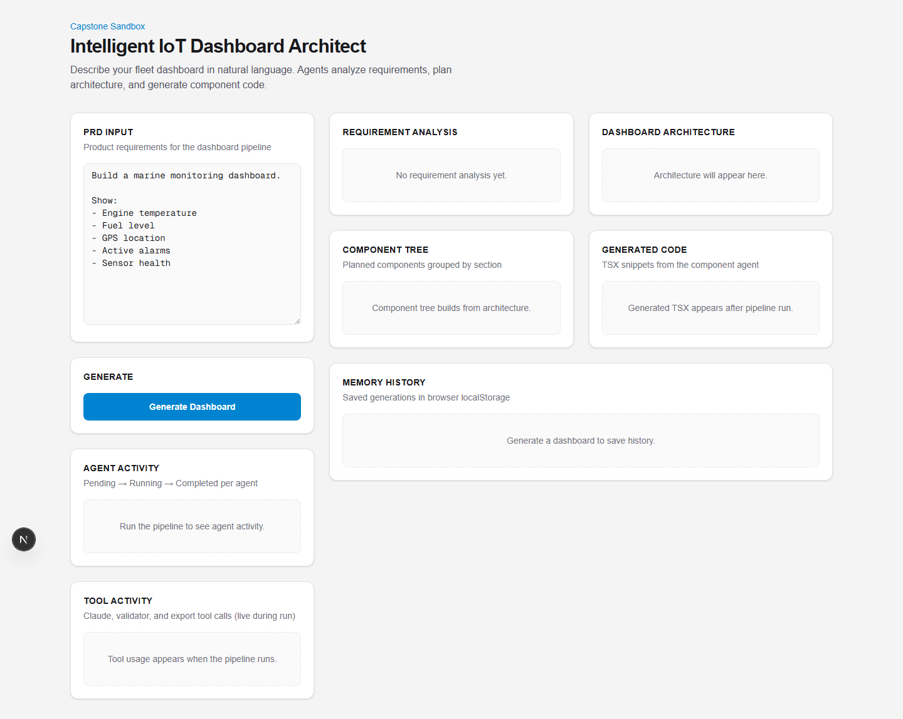
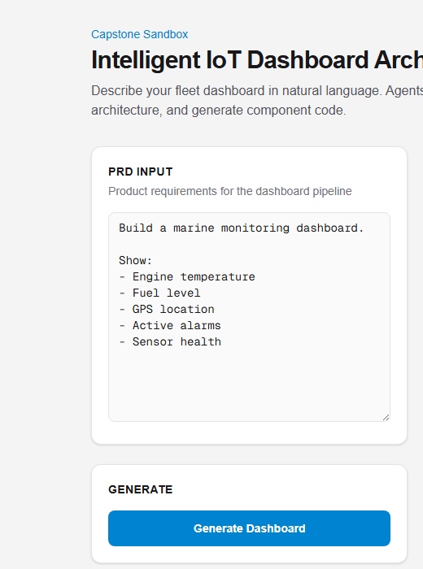
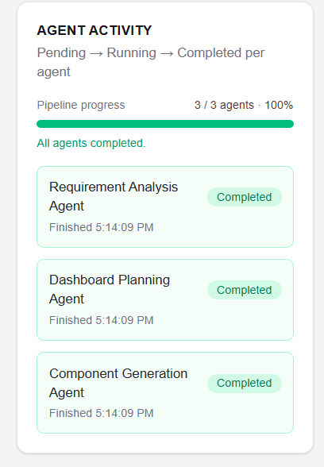
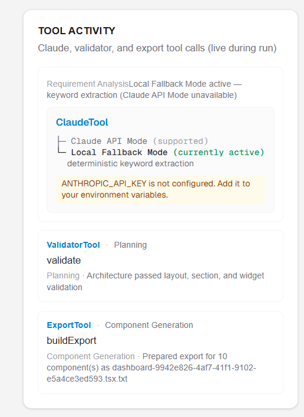
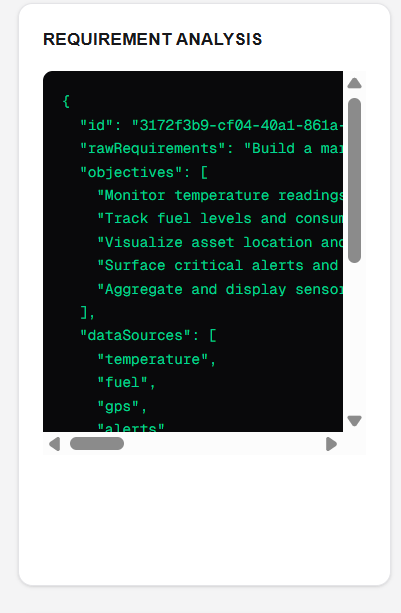
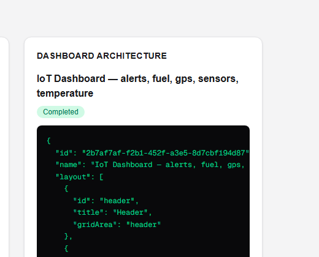
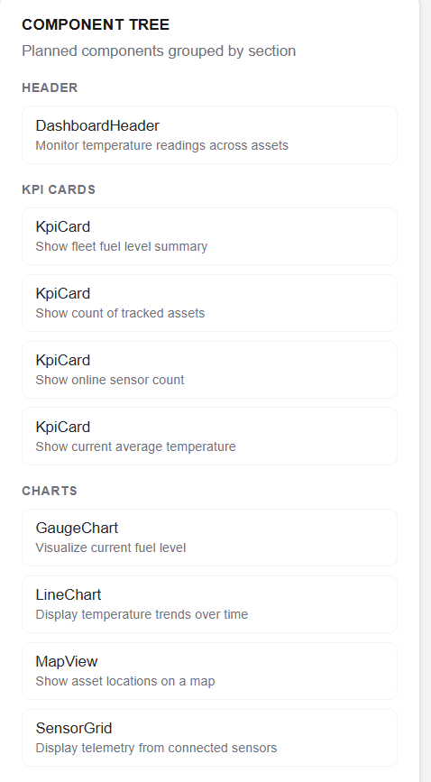
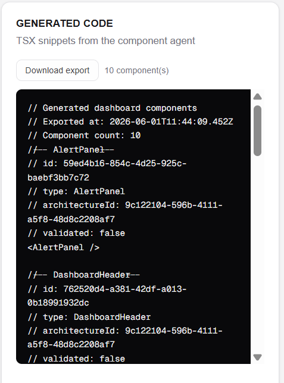
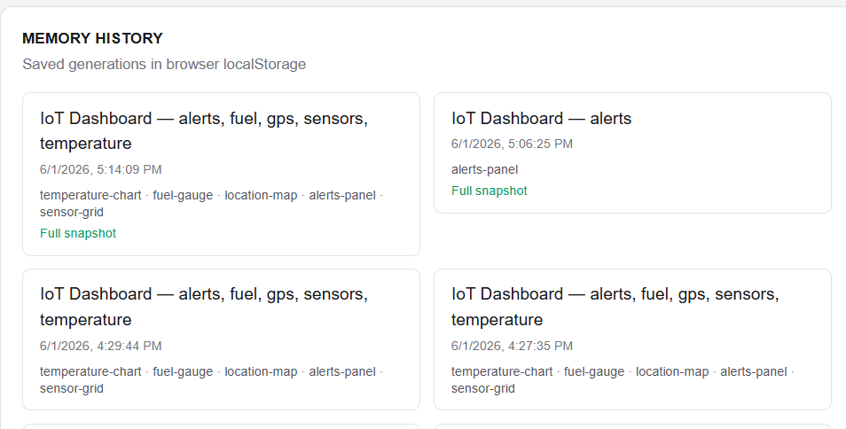

# Intelligent IoT Dashboard Architect

A capstone sandbox application that turns natural-language product requirements into structured IoT dashboard architectures and generated React component snippets. Built with **Next.js**, **TypeScript**, **Tailwind CSS**, and the **Anthropic Claude API**.

---

## Problem Statement

IoT fleet and marine monitoring teams often start dashboard projects with unstructured PRDs (product requirement documents) scattered across emails, wikis, and meetings. Translating that prose into a consistent dashboard layout—KPI cards, charts, maps, alert panels—and production-ready UI scaffolding is slow and error-prone.

**Intelligent IoT Dashboard Architect** addresses this by:

1. **Analyzing** PRDs into structured requirements (objectives, data sources, widgets, constraints).
2. **Planning** a deterministic dashboard architecture (sections, component plan, layout).
3. **Generating** TSX component snippets aligned with the plan.
4. **Validating** architecture completeness and **persisting** generations in the browser.

The system demonstrates a multi-agent pipeline with explicit tool calling, execution tracking, and graceful degradation when the Claude API is unavailable.

---

## Architecture

```
┌─────────────────────────────────────────────────────────────────────────┐
│                         Next.js App (app/page.tsx)                     │
│                    Dashboard UI — src/components/dashboard-architect.tsx │
└─────────────────────────────────┬───────────────────────────────────────┘
                                  │
                                  ▼
┌─────────────────────────────────────────────────────────────────────────┐
│                         PipelineService                                  │
│   requirement_analysis → planning → component_generation               │
│   (live progress via onProgress callback)                                │
└───────┬─────────────────────┬─────────────────────┬─────────────────────┘
        │                     │                     │
        ▼                     ▼                     ▼
┌───────────────┐   ┌─────────────────┐   ┌─────────────────────────┐
│ Requirement   │   │ Dashboard       │   │ Component               │
│ Analysis      │   │ Planning        │   │ Generation              │
│ Agent         │   │ Agent           │   │ Agent                   │
└───────┬───────┘   └────────┬────────┘   └───────────┬─────────────┘
        │                    │                        │
        ▼                    ▼                        ▼
┌───────────────┐   ┌─────────────────┐   ┌─────────────────────────┐
│ ClaudeTool    │   │ ValidatorTool   │   │ ExportTool              │
│ (API route)   │   │                 │   │                         │
└───────┬───────┘   └─────────────────┘   └─────────────────────────┘
        │
        ▼
┌───────────────────────────────────────┐
│ POST /api/analyze-prd                 │
│ src/lib/anthropic/analyze-requirements│
│ (@anthropic-ai/sdk — server only)     │
└───────────────────────────────────────┘

        SessionMemory (short-term, in-session)
        MemoryService (persistent, browser localStorage)
```

### Project structure

```
intelligent-iot-dashboard-architect/
├── app/
│   ├── api/analyze-prd/route.ts    # Anthropic PRD analysis (server)
│   ├── layout.tsx
│   ├── page.tsx
│   └── globals.css
├── src/
│   ├── agents/                     # Pipeline agents
│   ├── tools/                      # Claude, Validator, Export
│   ├── services/                   # PipelineService
│   ├── memory/                     # localStorage persistence
│   ├── components/                 # Dashboard UI
│   ├── lib/anthropic/              # SDK integration & parsing
│   └── types/                      # Shared TypeScript interfaces
├── docs/screenshots/               # UI screenshots (PNG, see Screenshots section)
├── .env.example
└── README.md
```

### Data flow

| Stage | Input | Output |
|-------|--------|--------|
| 1. Requirement analysis | Raw PRD text | `RequirementAnalysis` |
| 2. Planning | `RequirementAnalysis` | `DashboardArchitecture` + `ValidationResult` |
| 3. Component generation | `DashboardArchitecture` | `GeneratedComponent[]` + `ExportOutput` |

---

## Agent Descriptions

### 1. Requirement Analysis Agent

**File:** `src/agents/requirement-analysis-agent.ts`

- **Input:** Raw PRD string  
- **Output:** `RequirementAnalysis` (objectives, dataSources, widgets, constraints)  
- **Behavior:**
  - Calls **ClaudeTool** (`analyzePRD`) for LLM-structured JSON via `/api/analyze-prd`.
  - Runs **keyword extraction** locally (temperature, fuel, GPS, alerts, sensors).
  - **Merges** Claude output with keyword hits (keywords override empty Claude fields).
  - On API failure, **falls back** to keyword-only analysis without stopping the pipeline.

### 2. Dashboard Planning Agent

**File:** `src/agents/dashboard-planning-agent.ts`

- **Input:** `RequirementAnalysis`  
- **Output:** `PlanningAgentResult` — architecture + validation + tool usage  
- **Behavior:**
  - Builds a **deterministic** layout: `header`, `kpiCards`, `charts`, `alerts`.
  - Maps data sources to KPI cards and widgets to chart/alert components.
  - Calls **ValidatorTool** on the resulting architecture.

### 3. Component Generation Agent

**File:** `src/agents/component-generation-agent.ts`

- **Input:** `DashboardArchitecture`  
- **Output:** `ComponentGenerationAgentResult` — components + export + tool usage  
- **Behavior:**
  - Resolves TSX snippets from a modular template registry (`src/agents/component-snippets/`).
  - Examples: `<TemperatureChart />`, `<FuelKpi />`, `<AlertPanel />`.
  - Calls **ExportTool** to build a downloadable text bundle.

---

## Tool Calling

Agents remain **independent**; tools are injected via constructors and invoked explicitly. Tool usage is recorded and surfaced in pipeline results.

| Agent | Tool | Action | Purpose |
|-------|------|--------|---------|
| Requirement Analysis | `ClaudeTool` | `analyzePRD` | Structured PRD → `RequirementAnalysis` JSON |
| Dashboard Planning | `ValidatorTool` | `validate` | Layout, sections, and widgets checks |
| Component Generation | `ExportTool` | `buildExport` | TSX strings → downloadable `.tsx.txt` |

### ClaudeTool (Anthropic)

- **Client:** `src/tools/claude-tool.ts` — calls `POST /api/analyze-prd` (no SDK in browser bundle).
- **Server:** `src/lib/anthropic/analyze-requirements.ts` — Anthropic Messages API.
- **Env:** `ANTHROPIC_API_KEY` (required for live analysis).
- **Failure handling:** HTTP errors, parse errors, and network issues throw `ClaudeApiError`; the requirement agent catches and falls back.

### ValidatorTool

Validates `DashboardArchitecture`:

- Layout exists and sections have valid ids/titles.
- Required sections: `header`, `kpiCards`, `charts`, `alerts`.
- Each section has at least one widget; component plan is non-empty.

### ExportTool

- Builds plain-text export of all `sourceCode` snippets.
- `download()` triggers a browser file download (SSR-safe no-op on server).

### Pipeline tool usage

`PipelineRunResult.toolUsage` lists each call with `stage`, `tool`, `action`, `summary`, and `output`:

```json
{
  "stage": "requirement_analysis",
  "tool": "ClaudeTool",
  "action": "analyzePRD",
  "summary": "PRD analyzed via Anthropic (claude-sonnet-4-20250514)",
  "output": { "source": "anthropic", "model": "...", "analysisId": "..." }
}
```

---

## Memory

The project implements **two memory layers** required by the capstone rubric:

### Short-term — `SessionMemory`

**File:** `src/memory/session-memory.ts`

In-process memory for the active browser session (not written to disk):

| Method | Description |
|--------|-------------|
| `setPrdDraft()` / `getPrdDraft()` | Current PRD textarea content |
| `setCurrentRun()` / `getCurrentRun()` | Latest `PipelineRunResult` |
| `clear()` | Reset session state |

`PipelineService` updates session memory when a run starts (PRD) and completes (full result).

### Persistent — `MemoryService`

**File:** `src/memory/memory-service.ts`

Persists dashboard generations in **browser `localStorage`** (key: `iot-dashboard-architect:generations`). Survives page refresh and browser restart (same origin).

| Method | Description |
|--------|-------------|
| `saveGeneration()` | Store metadata, architecture, and optional **full pipeline snapshot** |
| `getHistory()` | All records, newest first |
| `loadGeneration(id)` | Retrieve one generation |

Each saved generation can include a `PipelineGenerationSnapshot` (analysis, components, export, toolUsage, execution, validation). The UI restores the **full dashboard state** when loading history entries that include a snapshot.

### Live tool activity

`PipelineService.run({ onToolUsage })` streams each tool call to the UI as agents finish, so **Tool Activity** updates during the run—not only after completion.

---

## Setup

### Prerequisites

- **Node.js** 20+
- **npm** (or pnpm/yarn)
- **Anthropic API key** ([console.anthropic.com](https://console.anthropic.com))

### Installation

```bash
git clone https://github.com/kavyaSherlySeby/thinkpalm-agentai-Kavya-Sebastian-Capstone-Sandbox-Full-Agent-Pipeline
cd intelligent-iot-dashboard-architect
npm install
```

### Environment variables

Copy the example file and add your API key:

```bash
cp .env.example .env.local
```

`.env.local`:

```env
ANTHROPIC_API_KEY=sk-ant-api03-...

# Optional
# ANTHROPIC_MODEL=claude-sonnet-4-20250514
```

| Variable | Required | Description |
|----------|----------|-------------|
| `ANTHROPIC_API_KEY` | Yes (for Claude) | Anthropic API key — server-side only |
| `ANTHROPIC_MODEL` | No | Default: `claude-sonnet-4-20250514` |

### Run locally

```bash
npm run dev
```

Open [http://localhost:3000](http://localhost:3000).

### Production build

```bash
npm run build
npm start
```

Set `ANTHROPIC_API_KEY` in your hosting provider’s environment (e.g. Vercel project settings).

### Optional: run pipeline from CLI

```bash
npx tsx src/test-pipeline.ts
```

> Note: CLI tests call agents directly; Claude analysis from CLI requires the dev server API or falls back to keyword extraction.

---

## Sample Input

Paste into the **PRD Input** textarea:

```text
Build a marine monitoring dashboard.

Show:
- Engine temperature
- Fuel level
- GPS location
- Active alarms
- Sensor health

Requirements:
- Real-time updates
- Historical trends for compliance reporting
```

---

## Sample Output

### Requirement Analysis

```json
{
  "id": "3b31c24e-2b05-48fe-bdee-f031632c0ded",
  "rawRequirements": "Build a marine monitoring dashboard...",
  "objectives": [
    "Monitor temperature readings across assets",
    "Track fuel levels and consumption",
    "Visualize asset location and movement",
    "Surface critical alerts and notifications",
    "Aggregate and display sensor telemetry"
  ],
  "dataSources": ["temperature", "fuel", "gps", "alerts", "sensors"],
  "widgets": [
    "temperature-chart",
    "fuel-gauge",
    "location-map",
    "alerts-panel",
    "sensor-grid"
  ],
  "constraints": [
    "Requires real-time data updates",
    "Must support historical data views"
  ],
  "createdAt": "2026-06-01T09:21:16.211Z"
}
```

### Dashboard Architecture (excerpt)

```json
{
  "name": "IoT Dashboard — alerts, fuel, gps, sensors, temperature",
  "layout": [
    { "id": "header", "title": "Header", "gridArea": "header" },
    { "id": "kpiCards", "title": "KPI Cards", "gridArea": "kpi-cards" },
    { "id": "charts", "title": "Charts", "gridArea": "charts" },
    { "id": "alerts", "title": "Alerts", "gridArea": "alerts" }
  ],
  "componentPlan": [
    {
      "type": "LineChart",
      "purpose": "Display temperature trends over time",
      "sectionId": "charts",
      "dataBinding": "temperature"
    }
  ]
}
```

### Generated Code (excerpt)

```tsx
// --- TemperatureChart ---
<TemperatureChart />

// --- FuelGauge ---
<FuelGauge />

// --- AlertPanel ---
<AlertPanel />
```

### Pipeline execution & tool usage (excerpt)

```json
{
  "execution": {
    "status": "completed",
    "stages": [
      { "stage": "requirement_analysis", "status": "completed" },
      { "stage": "planning", "status": "completed" },
      { "stage": "component_generation", "status": "completed" }
    ]
  },
  "toolUsage": [
    {
      "stage": "requirement_analysis",
      "tool": "ClaudeTool",
      "action": "analyzePRD",
      "summary": "PRD analyzed via Anthropic (claude-sonnet-4-20250514)"
    },
    {
      "stage": "planning",
      "tool": "ValidatorTool",
      "action": "validate",
      "summary": "Architecture passed layout, section, and widget validation"
    },
    {
      "stage": "component_generation",
      "tool": "ExportTool",
      "action": "buildExport",
      "summary": "Prepared export for 8 component(s) as dashboard-....tsx.txt"
    }
  ]
}
```

---

## Screenshots

Capture the UI after `npm run dev` and save PNGs under `docs/screenshots/`:

```bash
npm run capture-screenshots
```

| Screenshot | Description |
|------------|-------------|
|  | Full dashboard UI |
|  | PRD textarea and Generate button |
|  | Pending → Running → Completed progress |
|  | Live Claude / Validator / Export tool cards |
|  | Structured JSON output |
|  | Dashboard architecture panel |
|  | Components grouped by section |
|  | TSX export preview |
|  | Saved generations with full snapshot badge |

Regenerate with `npm run capture-screenshots` (dev server must be running). See `docs/screenshots/README.md`.

---

## Future Improvements

- **Live data bindings** — Connect generated components to real MQTT/WebSocket telemetry.
- **Richer Claude schemas** — Tool-use / JSON schema mode for stricter `RequirementAnalysis` parsing.
- **Architecture auto-repair** — Re-plan when `ValidatorTool` reports missing section widgets.
- **Full pipeline persistence** — Store analysis, components, and export in memory (not only architecture).
- **User authentication** — Server-side generation history instead of `localStorage` only.
- **Component preview** — Render generated TSX in an iframe sandbox.
- **Multi-dashboard templates** — Marine, fleet, factory, and smart-building presets.
- **Streaming agent output** — SSE for token-by-token PRD analysis and stage logs.
- **Evaluation harness** — Golden PRD fixtures with regression tests for agents and tools.
- **Deploy & CI** — GitHub Actions for lint, typecheck, build, and optional E2E with Playwright.

---

## Tech Stack

| Layer | Technology |
|-------|------------|
| Framework | Next.js 16 (App Router) |
| Language | TypeScript 5 |
| Styling | Tailwind CSS 4 |
| LLM | Anthropic Claude (`@anthropic-ai/sdk`) |
| UI | React 19 — no external component libraries |

---

## License

Private capstone sandbox — see repository owner for licensing terms.
